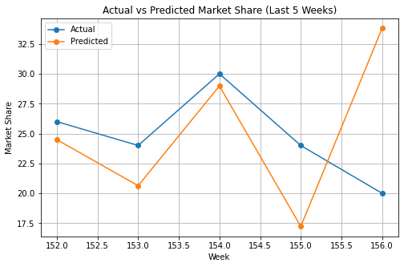

# Market Share Modeling for Consumer Goods Brand

## Project Overview

This project analyzes real-world retail scanner data to understand how pricing strategies, promotional activities, and customer behavior influence the market share of a consumer goods brand.

The analysis also develops predictive models to forecast future market share trends and support data-driven business decisions.
## Forecasting Result

---

## Business Objectives

• Identify key drivers of market share fluctuations
• Quantify impact of pricing strategies
• Evaluate promotional effectiveness
• Understand loyal vs non-loyal customer behavior
• Forecast future market share trends

---

## Dataset

• Weekly retail scanner data
• 101 observations
• Includes pricing, promotions, and customer behavior metrics

---

## Methods Used

• Exploratory Data Analysis (EDA)
• Multiple Linear Regression
• Model Diagnostics (Residual Analysis, Cook’s Distance)
• Box-Cox Transformation
• Market Share Forecasting

---

## Key Findings

• Market share is primarily driven by non-loyal customers
• Promotional activities significantly influence short-term performance
• Relative price negatively impacts competitive positioning
• The final model explains a substantial portion of share variability

---

## Tools

Python, Pandas, Statsmodels, Matplotlib

---

## Business Impact

The results provide actionable insights for optimizing pricing and promotional strategies to improve market share performance.

---

